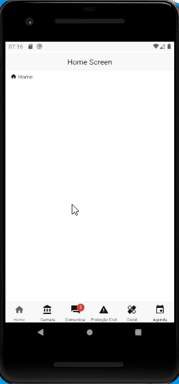

# Go Go Life - Teste Prático

<h3>Executando projeto em ambiente local</h3>

#### Clone este projeto do Github
`$ git clone https://github.com/steferson-augusto/go-go-life.git`

#### Abra o projeto no terminal
`$ cd go-go-life`

A pasta `/api` foi escrita usando as serverless functions do Next.js e é responsável por servir os endpoints necessários

A pasta `/mobile` foi feito com React Native, sendo responsável pela aplicação mobile

#### Inicie a API
Abra a pasta `/api` executando `$ cd api`

Execute `$ yarn` para instalar as dependências do node_modules.

Em seguida, execute `$ yarn run dev` para iniciar a API

Assim, a API iniciará na máquina local rodando na porta 3000

#### Abra a pasta `go-go-life/mobile` no terminal

#### Certifique-se de possuir o ambiente de trabalho configurado para o uso do React Native

https://reactnative.dev/docs/environment-setup

#### Execute `$ yarn` para instalar as dependências

#### Certifique-se de possuir um AVD configurado ou conecte um aparelho Android via USB

Criar AVD: https://developer.android.com/studio/run/managing-avds.html

Conectar via USB: https://reactnative.dev/docs/running-on-device

#### Inicie a aplicação executando `$ yarn run android`

  

