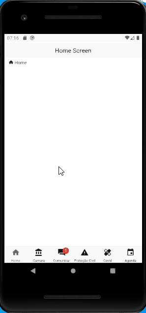

API criada com Next.js Serverless Functions.

## Instalação e Uso

Instale as dependências e execute localmente:

```bash
$ yarn
$ yarn run android
```

Lembre-se de possuir um ambiente de produção configurado, juntamente de um AVD criado ou um aparelho Android conectado via USB.

[Configurando o ambiente de trabalho](https://reactnative.dev/docs/environment-setup)

[Conectando via USB](https://reactnative.dev/docs/running-on-device)

[Criar AVD](https://developer.android.com/studio/run/managing-avds.html)


## Resultado

<p align="center">
  
</p>
